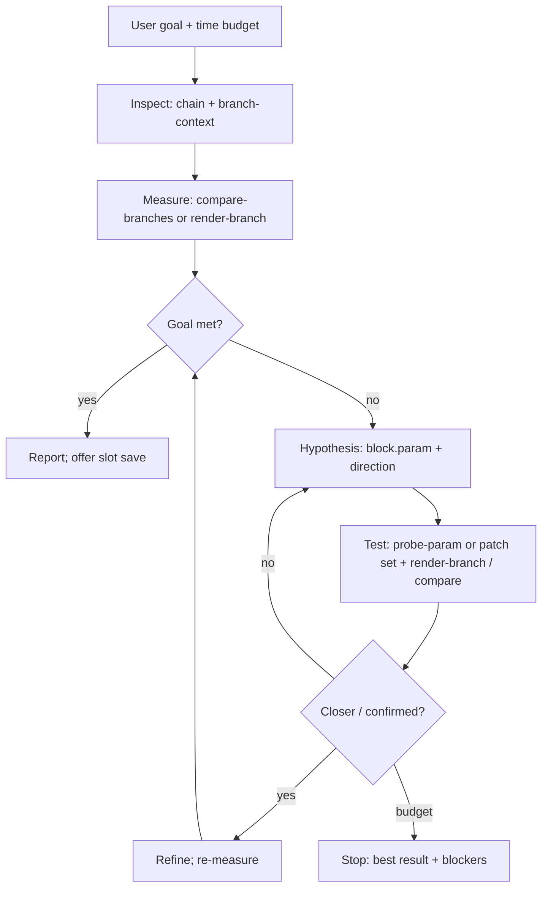

# Audio Lab — Agent-Guided Investigation

USB re-amp sessions let an agent run **quantitative before/after experiments** on the connected GT-1000. The CLI provides **primitives** (measure, inspect, write, restore). The **agent** owns the loop: inspect → hypothesize → test → repeat until the goal is met or a time budget expires.

Level-matching two divider branches is one example goal, not a built-in closed-loop command.

## When to use this

- User wants a measurable outcome on the **same dry take** (e.g. “balance DIV1 A and B within 1 dB”, “see if drive is 3 dB hotter than clean”).
- Patch uses a **divider in single mode** (or you can explain why compare-branches refused).
- Hardware: GT-1000 USB, audio deps installed, `audio prepare-reamp` / DIR MON understood ([audio-lab-reamp-protocol.md](audio-lab-reamp-protocol.md)).

Default investigation budget unless the user says otherwise: **5 minutes** of MIDI + re-amp steps. Log each iteration (hypothesis, command, metric) in the session `meta.json` `events` list or your run notes.

## Primitives (composable)

| Primitive | Command | Role |
|-----------|---------|------|
| Chain inspect | `patch chain --live` | Full routing, unreachable branches |
| Block inspect | `patch block <id> --live` | Current parameter values |
| Branch context | `audio branch-context --divider divider1 --live` | Divider state, per-branch blocks + adjustable params, reachability (no re-amp) |
| Baseline A/B | `audio compare-branches --session <s> --divider divider1` | Two renders (A/B), Δ RMS; restores divider bytes |
| Screen controls | `audio probe-branch --session <s> --channel branch-B` | Low/high probe per candidate block; ranked `effectiveControls` |
| Single-param test | `audio probe-param --session <s> --channel branch-B --block dist1 --param level` | One hypothesis check; restores probed block |
| Single branch measure | `audio render-branch --session <s> --channel branch-B --label try1` | One re-amp after your `patch set`; restores divider by default |
| Steady-state metrics | `audio analyze-trimmed wet.wav --trim-start 2 --trim-end 1.5` | RMS on middle of file (skip settle/tail) |
| Full render | `audio session render --session <s> --label <name>` | Wet under current patch (no channel select) |
| Analyze | `audio analyze <a.wav> <b.wav>` | File metrics / deltas |
| Apply edit | `patch set <block> <param> <value> --live [--verify]` | Validated temp-patch write |
| USB prep | `audio prepare-reamp` | DIR MON off (once per investigation) |
| Session | `audio session init`, `audio generate-tone` / `record-dry` | Shared `dry.wav` |

Do **not** assume divider `levelA` / `levelB` work until `probe-param` or `probe-branch` shows `affectsReamp: true`.

## Investigation loop (agent-owned)



### 1. Inspect

```bash
scripts/gt1000-agent --pretty patch chain --live --timeout 15
scripts/gt1000-agent --pretty audio branch-context --divider divider1 --live --timeout 15
```

### 2. Hypothesis

State explicitly, e.g. “Branch B is −7 dB vs A; `dist1.level` on path B should raise B toward A when increased.”

### 3. Test

**Screen candidates (mechanical):**

```bash
scripts/gt1000-agent --pretty audio probe-branch --session div-inv --channel branch-B --no-prepare-usb
```

**Confirm one control:**

```bash
scripts/gt1000-agent --pretty audio probe-param --session div-inv --channel branch-B --block dist1 --param level --no-prepare-usb
```

**Apply + measure:**

```bash
scripts/gt1000-agent --pretty patch set dist1 level 75 --live --timeout 20
scripts/gt1000-agent --pretty audio render-branch --session div-inv --channel branch-B --label dist75 --experiment-note "dist1=75" --no-prepare-usb
scripts/gt1000-agent --pretty audio compare-branches --session div-inv --divider divider1 --no-prepare-usb
```

Use `--trim-start` / `--trim-end` on `render-branch` or `analyze-trimmed` for long tones (steady-state repeatability).

### 4. Loop

- Re-measure after each meaningful edit.
- Respect time budget (~5 min default).
- Restore: `compare-branches` / `render-branch` / `probe-*` restore divider or probed blocks; re-`patch select` if the temp patch is messy.

## Example goal: DIV1 branches within 1 dB

```bash
scripts/gt1000-agent --pretty audio session init --session div-inv --live --midi-timeout 20
scripts/gt1000-agent --pretty audio generate-tone --session div-inv --duration 10
scripts/gt1000-agent --pretty audio prepare-reamp --midi-timeout 15
scripts/gt1000-agent --pretty audio branch-context --divider divider1 --live
scripts/gt1000-agent --pretty audio compare-branches --session div-inv --divider divider1 --no-prepare-usb
scripts/gt1000-agent --pretty audio probe-branch --session div-inv --channel branch-B --no-prepare-usb
# Agent picks best effectiveControl, iterates patch set + compare-branches until |Δ| ≤ 1 dB or timeout
```

## Agent reporting

Per iteration: **hypothesis**, **commands**, **metric** (Δ RMS or branch RMS), **conclusion**.

### Present findings (required close-out)

After the loop ends—success, partial progress, or timeout—give the user a **single structured summary** in plain language. Do not dump raw JSON unless they ask.

| Section | Content |
|---------|---------|
| **Goal** | What they asked for (e.g. “match DIV1 branch B to branch A within 1 dB on USB re-amp”). |
| **Baseline** | Starting Δ or branch levels (e.g. “B was ~7.6 dB quieter than A”). |
| **What we tried** | Short list: probes that failed vs the control that worked (block + parameter, not SysEx). |
| **Result** | Final metric vs goal (e.g. “Δ −0.5 dB — within 1 dB target”). |
| **Musical meaning** | One sentence on what changed in the patch (e.g. “Distortion 1 level on the drive path was raised from 100 to 79.”). |

If the goal was **not** met, say what blocked progress (no effective control, parameter already at limit, time budget, unreachable blocks) and what you would try next.

### Offer to update the patch (user discretion only)

**Never** write a user slot or claim the patch was saved unless the user explicitly agrees.

1. **Note:** `compare-branches`, `probe-param`, and `probe-branch` **restore** divider and probed block bytes when they finish. The winning edit usually exists only in your experiment notes until you apply it again on the temp patch.

2. **If successful (or the user accepts a partial fix):** offer to apply the same validated edits to the patch they are working on:
   - **Hear only (temp patch):** re-run the agreed `patch set … --live --verify` commands on the temporary patch so they can play and confirm by ear.
   - **Save to a user slot:** only after they name a slot (e.g. “save to U01-3”). Use `patch set <block> <param> <value> --live --user-slot <slot> --verify --timeout 30` for each change, or another typed persistent path they request.

3. **Wording example:** “Branch B now matches A within about 0.5 dB on the test tone by setting Distortion 1 level to 79. Your patch on the unit was restored after the test—nothing is saved yet. Want me to apply that to the current patch so you can try it, or save it to a user slot?”

4. **Agent dev slots:** unless the user names another slot, prefer their current patch; for agent-initiated *unsolicited* persistent experiments use U10-1…U11-5 per [AGENTS.md](../AGENTS.md).

5. **Do not** auto-run `--user-slot`, `patch clone`, or bank-wide writes as part of the investigation close-out.

## Verifying the workflow

To test that an agent reaches the same conclusions as a known patch (e.g. IMPRESSION `U01-3`, `dist1.level` not `divider1.levelB`), use [audio-lab-investigation-verification.md](audio-lab-investigation-verification.md): fresh-agent prompt, pass/fail rubric, and a mechanical CLI replay script.

## Related

- [audio-lab-investigation-verification.md](audio-lab-investigation-verification.md)  
- [audio-lab-roadmap.md](audio-lab-roadmap.md)  
- [AGENTS.md](../AGENTS.md)  
- [audio-lab-reamp-protocol.md](audio-lab-reamp-protocol.md)
