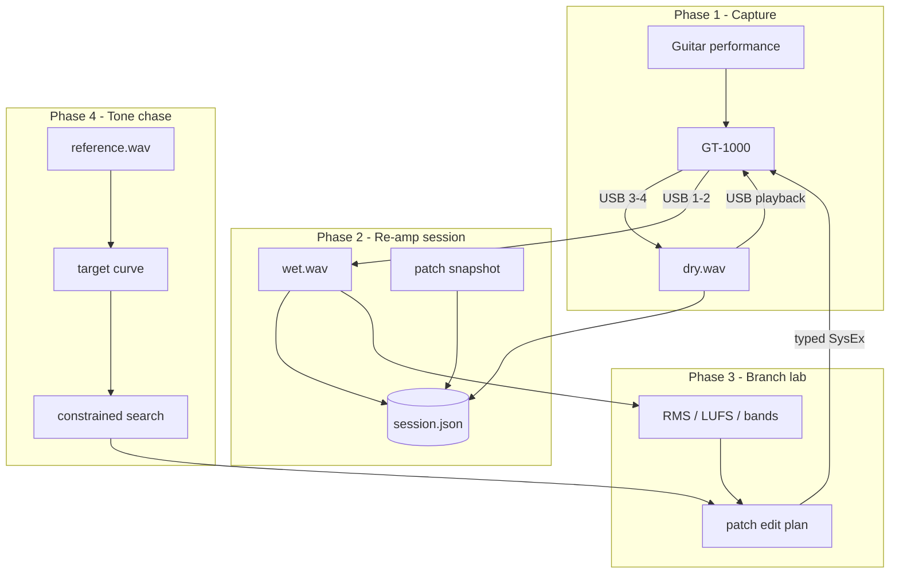

# Audio Lab Roadmap

Implementation plan for USB dry capture, GT-1000 re-amping, DSP comparison, and (later) reference-tone matching. This extends the existing SysEx/patch CLI; it does not replace it.

**Status:** Phases 1-4 complete and validated on hardware. Reference-tone chasing runs end-to-end with descriptor-aware scoring, bounded temp-patch search, inactive-block candidate filtering, abort-safe restore, and musician-facing agent guidance; the live reference run test passes repeatedly, including the post-audio restore path.
**Related:** [midi-cli-roadmap.md](midi-cli-roadmap.md), [musician-cli-backlog.md](musician-cli-backlog.md), [AGENTS.md](../AGENTS.md), [audio-lab-reamp-protocol.md](audio-lab-reamp-protocol.md), [midi-reference/address-map.md](../skills/gt1000/references/midi-reference/address-map.md)

## Vision

| Horizon | Goal |
|--------|------|
| **Short term** | Record and store a **dry guitar take** over USB; **re-amp** that take through the GT-1000; **measure** processed output; **compare** branches (e.g. DIV1 clean vs drive) and iteratively adjust typed patch parameters until loudness (and later tone) targets are met. |
| **Long term** | **Tone chasing:** user supplies an isolated reference guitar tone; agent uses spectral objectives + constrained patch search + A/B re-amp trials to approach that sound on the user’s rig. |

## Design principles

1. **Patch truth stays in the existing CLI** — SysEx reads/writes, validation, `--verify`, undo. No raw SysEx from the audio layer.
2. **Audio is file-based** — WAV sessions on disk; PortAudio (`sounddevice`) for I/O on macOS. No hard dependency on a specific DAW.
3. **One orchestrator process** — sequential live MIDI + audio to avoid interleaved SysEx replies (see AGENTS.md).
4. **Reproducibility** — every render stores patch snapshot metadata, USB routing snapshot, sample rate, and channel map.
5. **Musician-facing skill stays clean** — workflow and safety boundaries in SKILL.md; this document and AGENTS.md hold implementation detail.

## GT-1000 USB audio model (reference)

| USB channels (in to computer) | Content |
|------------------------------|---------|
| 1–2 | Main processed |
| 3–4 | Dry (re-amp source) |
| 5–6 | Sub processed |

Playback from the computer re-enters the unit for re-amping. On firmware **1.20+**, use the documented **MAIN** playback device so playback is not unintentionally re-effected (see BOSS USB driver README / ultimate guide).

CLI today: **`system inout --live`** decodes `usbDryOut`, `usbDryToEfx`, `usbMainEfxOut`, `usbMainMixLevel`, `usbSubEfxOut`, `usbSubMixLevel` (read-only). Divider blocks expose `levelA`, `levelB`, `channelSelect`, etc. (`divider1` … `divider3` in `live.py`).

## Architecture



## Code layout (target)

| Area | Path |
|------|------|
| Audio I/O + metrics | `skills/gt1000/tools/gt1000/audio_lab/` |
| CLI wiring | `skills/gt1000/tools/gt1000/agent_cli.py` (`audio` subcommand group) |
| Session schema | `skills/gt1000/tools/gt1000/audio_lab/session.py` |
| Unit tests | `tests/test_audio_lab.py` |
| Live tests (optional) | `tests/test_live_audio_lab.py` gated on `GT1000_LIVE=1` + `GT1000_AUDIO_LIVE=1` |
| Agent notes | AGENTS.md section + optional `references/skill-developer.md` link |

Default session root: `~/gt1000-sessions/` or `$GT1000_SESSION_DIR` (override). Layout:

```text
sessions/
  2026-05-28-div1-balance/
    dry.wav
    meta.json
    renders/
      001-baseline-wet.wav
      001-baseline-patch.json
      002-levelB-plus3-wet.wav
      ...
```

## Phase 1 — Audio I/O foundation

**Outcome:** Record dry from USB; re-amp one file to wet; analyze two WAVs with comparable metrics. No automated patch editing.

### Deliverables

| Item | Description |
|------|-------------|
| `audio record-dry` | Capture from GT-1000 USB inputs 3–4 (configurable); write `dry.wav` + `meta.json` (sr, channels, duration, device name). |
| `audio reamp` | Play input WAV to GT-1000 playback device; capture 1–2 to `wet.wav`; same metadata. |
| `audio analyze` | JSON report: peak, RMS, integrated loudness (LUFS if `pyloudnorm` or equivalent), optional band RMS (octave or fixed bands). |
| `audio ports` | List Core Audio devices/channels relevant to GT-1000 (companion to `ports --live` for MIDI). |
| Preflight | Fail fast if GT-1000 audio device missing; document sandbox/macOS permission needs (mirror CoreMIDI notes). |

### CLI sketch

```sh
scripts/gt1000-agent --pretty audio ports
scripts/gt1000-agent --pretty audio record-dry --duration 20 --session div1-test
scripts/gt1000-agent --pretty audio reamp --session div1-test --input dry.wav --output renders/manual-001.wav
scripts/gt1000-agent --pretty audio analyze --files renders/a.wav renders/b.wav
```

### Tests

- Unit: synthetic sine WAV → analyze → expected RMS within tolerance.
- Unit: session path creation, meta.json round-trip.
- Live (optional): `record-dry` 3s + `reamp` round-trip with `-20 dBFS` fixture tone if hardware loopback not required (playback file only).

### Exit criteria

- [x] CLI commands: `audio ports`, `generate-tone`, `record-dry`, `reamp`, `analyze`.
- [x] Unit tests in `tests/test_audio_lab.py`.
- [x] Documented in AGENTS.md; not duplicated in SKILL.md.
- [x] Dry capture and re-amp return non-silent wet signal on connected hardware (sounddevice + DIR MON prep; see live audio tests).
- [x] `analyze` produces stable metrics for two files in &lt;1s.

---

## Phase 2 — Repeatable re-amp protocol & USB routing control

**Outcome:** One blessed “lab session” workflow; USB mix levels readable and writable; every render tied to patch + routing snapshots.

### Deliverables

| Item | Description | Status |
|------|-------------|--------|
| `audio session init` | Create session dir; snapshot `system inout` + current patch (`patch dump` subset or chain + PatchEfct). | Done (`--live` → `deviceSnapshots/*.json`) |
| `audio session render` | `render --label foo` = re-amp dry → wet + write `renders/foo-wet.wav` + `renders/foo-patch.json` + append to session log. | Done |
| `system inout-set` (or `system set inout`) | Typed writes for USB nibble fields with `--verify` and range validation (mirror `decode_system_inout` offsets). | Done |
| Re-amp protocol doc | In-repo checklist: playback device, monitoring off, USB channel map, settle time after patch write. | Done ([audio-lab-reamp-protocol.md](audio-lab-reamp-protocol.md)) |
| Orchestrator hook | Single Python entry that holds MIDI client + audio stream (no parallel `gt1000-agent` processes). | Done (`audio_lab/orchestrator.py`) |

### CLI sketch

```sh
scripts/gt1000-agent --pretty audio session init --name div1-balance
scripts/gt1000-agent --pretty system inout-set usb-dry-out 100 --live --verify --timeout 20
scripts/gt1000-agent --pretty audio session render --label baseline
```

### Tests

- Unit: encode/decode USB nibble fields (reuse patterns from `test_user_patch_read.py` inout fixtures).
- Unit: session render appends log entry with patch snapshot hash.
- Live: write USB field → read back → `session render` produces second wet file.

### Exit criteria

- [x] Two renders of the same patch on the same dry file are within 0.5 dB RMS (stability; live test `test_session_render_repeatability`).
- [x] USB routing snapshots stored on `session init --live`; writes via `system inout-set --verify`.
- [ ] Agent dev slots only: persistent patch experiments use U10-1…U11-5 per AGENTS.md unless user overrides (unchanged policy).

---

## Phase 3 — Branch comparison & agent-guided experiments

**Outcome:** DIV1-style workflows: measure channel A vs B on the same dry take; agent uses CLI primitives to inspect, hypothesize, and test edits toward a quantitative goal (e.g. balance branches within 1 dB). See [audio-lab-investigation.md](audio-lab-investigation.md).

### Deliverables

| Item | Description | Status |
|------|-------------|--------|
| `audio compare-branches` | Render channel A/B via `channelSelect`; report Δ metrics; restore divider. | Done |
| `audio branch-context` | Inspect divider branches and adjustable params (no re-amp). | Done |
| `audio probe-branch` / `probe-param` | Screen/test whether parameters move USB re-amp level. | Done |
| `audio render-branch` | Single-branch re-amp + metrics (optional trim, experiment note). | Done |
| `audio analyze-trimmed` | Steady-state RMS on trimmed WAV regions. | Done |
| `patch set` | Validated edits on temp patch (blocks, divider, etc.). | Done (pre-existing) |
| Agent protocol | Inspect → hypothesize → test → present findings → offer patch update on consent; doc in audio-lab-investigation.md. | Done |

### DIV1 example flow

1. User: “Dist side of DIV1 is softer than clean.”
2. Agent: `branch-context` + `compare-branches` → hypothesis (e.g. `dist1.level` on branch B).
3. `probe-branch` or `probe-param` to confirm control affects USB level.
4. Agent loop: `patch set` + `render-branch` / `compare-branches` until goal or timeout; offer slot save on request.

### Tests

- Unit: mock patch snapshots → compare-branches builds correct write plan for channel A/B.
- Unit: branch-context block lists, probe ranking (mocked).
- Live: `probe-param` / `compare-branches` on divider patch (opt-in `GT1000_COMPARE_LIVE=1`).

### Exit criteria

- [x] Automated A/B on real dry take via `audio compare-branches` (temp patch; restores divider bytes after).
- [x] Agent can reach ≤1 dB branch balance using primitives + `patch set` (e.g. `dist1.level` on IMPRESSION; not divider LEVEL B).
- [x] Divider state restored after compare/match (`restore_divider_data`); use `patch undo-last` for wider rollback if needed.

---

## Phase 4 — Reference tone chasing

**Outcome:** User provides reference WAV (isolated guitar); agent derives spectral target, proposes constrained patch variants, re-amps dry take against each, ranks by objective, returns best + diff report.

### Deliverables

| Item | Description | Status |
|------|-------------|--------|
| `audio reference analyze` | Band energy curve, spectral centroid, crest, and descriptor profiles (`space`, `highEnd`, `lowBody`, `envelope`, `leadMid`); store `reference-profile.json`. | Done |
| `audio match-reference` | Score wet render vs profile (weighted bands, descriptor shape, loudness penalty); optional `--emphasis` presets (`balanced`, `mids`, `low`, `high`). | Done |
| Search planner | Descriptor-aware bounded search over **typed** knobs: amp type, gain, EQ bands, cab sim, drive/reverb/delay, key block levels — not full patch space. `audio reference plan` + `audio reference run`. | Done |
| Candidate budget | Default max 12 renders per session; human can approve expansion. | Done |
| Inactive-block filtering | `audio reference run` reads each target block's switch byte first, skips candidates whose block is bypassed (a write would verify but never change the wet render), and backfills the budget from a larger planner pool. | Done |
| Run reliability & abort safety | Post-audio CoreMIDI endpoint refresh (process MIDI client + run-loop pump in `live.py`), process-level retry for fresh post-audio MIDI writes, and an abort-time emergency restore of all captured original bytes so the temp patch is never left mutated. | Done |
| Skill guidance | Tone chasing is iterative and approximate; cite limits (DI vs mic, playing dynamics). See `references/audio-lab-reference-tone.md`. | Done |

### Objective (v1)

Minimize:

```text
score = w_band * sum_b (log E_b(wet) - log E_b(ref))^2 + w_lufs * (LUFS(wet) - LUFS(ref))^2
```

Optional: user weights “more mids” via band weight overrides.

### Tests

- Unit: synthetic tones → ranker orders closer spectrum first; descriptor metrics and planner ordering; band-emphasis presets.
- Live: reference profile + dry take → `audio reference run --max-candidates 3` ranks distinct scores and restores temp patch bytes.

### Exit criteria

- [x] End-to-end: reference WAV + dry take → baseline + bounded temp-patch candidates rendered and ranked for audition (`audio reference run`).
- [x] No non-validated SysEx; all candidate writes go through existing patch edit paths with verify-before-render.
- [x] Clear “not a match guarantee” in musician-facing output and CLI notes.
- [x] Descriptor-aware planner and scoring (`space`, `highEnd`, `lowBody`, `envelope`, `leadMid`) with diff reports and audition shortlist.
- [x] Optional band-emphasis weighting for user goals such as “more mids”.
- [x] Candidate budget is spent on audible changes: bypassed-block candidates are skipped up front and replaced from the planner pool.
- [x] Live reference run (`test_generated_tone_simulates_recording`) passes repeatedly on connected hardware, including the post-audio restore path.
- [x] An aborted run attempts a best-effort restore of every captured original byte range before re-raising.

---

## Cross-phase dependencies

| Dependency | Phases |
|------------|--------|
| Python 3.9+ | All |
| `numpy` + `sounddevice` (`skills/gt1000/requirements-audio.txt`) | 1+ |
| Optional `pyloudnorm` | 1+ (LUFS) |
| Core Audio permissions (non-sandboxed agent) | 1+ live |
| Existing `live.py` / `patch_edit.py` | 2+ |
| `patch undo-last` / restore points | 3+ |

## Out of scope (for this roadmap)

- DAW plug-in or VST.
- Real-time monitoring UI.
- ML amp modeling / neural tone clone.
- **`GT-1000 DAW CTRL`** MIDI port (transport); USB **audio** only.
- Committing sample WAVs to the git repo.

## Open questions

1. **Sample rate:** Lock session to device rate (44.1 kHz today) or resample on analyze?
2. **Playback path on macOS:** Device name strings for MAIN vs DRY playback — enumerate and document per driver version.
3. **CTL vs SysEx for divider toggle:** Prefer temporary `divider1.channelSelect` writes vs simulating footswitch during re-amp?
4. **Live test policy:** Require dedicated scratch slot + backup dir like destructive MIDI tests?

## Implementation order (sprints)

| Sprint | Phase | Focus |
|--------|-------|--------|
| A | 1 | `audio_lab` package, `record-dry`, `reamp`, `analyze`, unit tests — **done** |
| B | 2 | Session dirs, `session render`, `system inout` writes, orchestrator — **done** |
| C | 3 | Investigation primitives + compare-branches; agent-led DIV1 proof — **done** |
| D | 4 | Reference profile, descriptor scoring, bounded planning, temp-patch render/rank, band-emphasis presets, and musician-facing guidance — **done** |

## Agent / skill integration (after Phase 2)

Add to **skill-developer** / AGENTS.md (not musician SKILL.md):

- Quantitative patch goals → follow [audio-lab-investigation.md](audio-lab-investigation.md); use compare-branches / probe-branch before guessing block names.
- Cap automated writes; always offer undo.
- Never adjust USB routing without reading `system inout` first.

## Success metrics

| Phase | Metric |
|-------|--------|
| 1 | Dry + wet files recorded; analyze distinguishes ±3 dB level change |
| 2 | Same patch, two renders: ≤0.5 dB LUFS drift |
| 3 | DIV1 A/B within 1 dB after agent-led experiment loop |
| 4 | Reference chase: best candidate lowers band score ≥30% vs baseline patch |

---

*Last updated: 2026-06-10*
